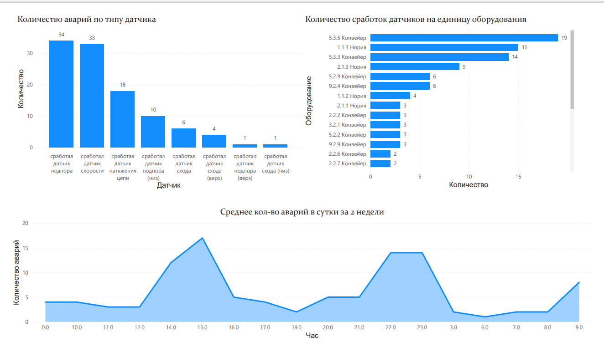

 

##  🚀 Анализ отказов датчиков на производстве. 

### Исходные данные:
- Источник: CSV-логи хронологии SCADA-системы
- Обработка: Данные очищены, отфильтрованы и агрегированы
- Объём выборки: 107 зафиксированных сработок датчиков

## Общая картина
Наиболее проблемные типы датчиков:
- Датчик подпора
- Датчик скорости
- Датчик натяжения цепи

## Критические объекты (топ-5 по количеству сработок):
- Конвейер 5.3.5
- Нория 1.1.3
- Конвейер 5.3.3
- Нория 2.1.3
- Конвейер 9.2.4

## Детализация по объектам
Группа "Нории" (1.1.3, 2.1.3): Преобладают сработки датчика скорости  
Для нории 2.1.3 характерны также частые сработки датчика подпора (низ): Значительная доля — датчик скорости  
Группа "Конвейеры" (5.3.3, 5.3.5): Основная причина — датчик подпора. Значительная доля — датчик скорости    

## Временной анализ и интерпретация
Выявлена устойчивая зависимость от времени суток:

Чёткие пики аварийности:
~14:00 — возможная связь с запуском/перезапуском после обеденного перерыва, увеличением нагрузки  
~22:00–23:00 — вероятно, связано с окончанием смены, максимальной накопленной нагрузкой и/или усталостью персонала  

Наличие регулярных утренних и вечерних провалов в активности подтверждает общую циклическую закономерность.

